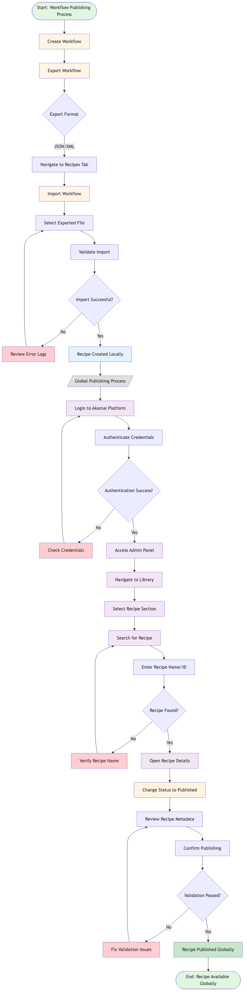
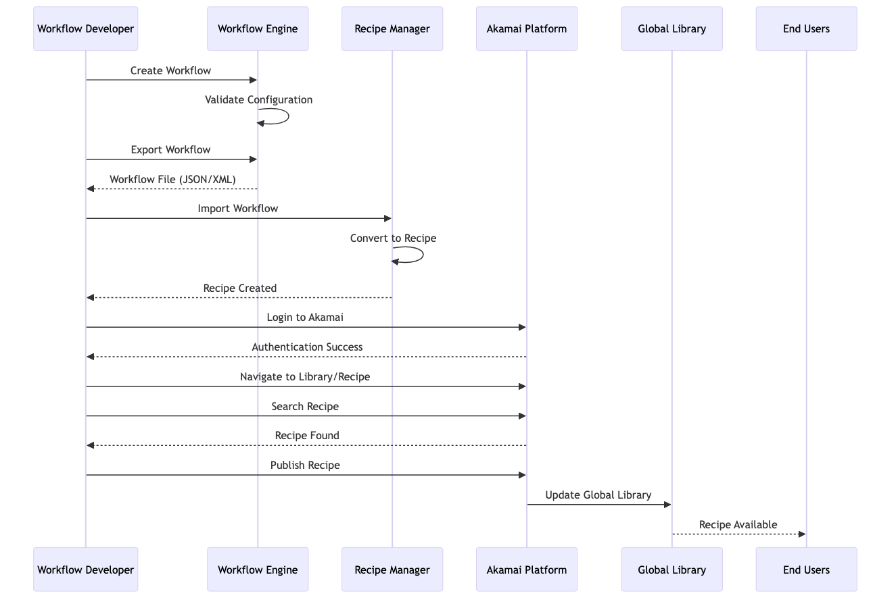

# Workflow to Recipe Publishing - Flow Diagrams

This directory contains visual flow diagrams for the workflow-to-recipe publishing process, designed for technical and architectural audiences.

## Generated Diagram Images

### 1. Main Workflow Publishing Flow Diagram
**File:** `workflow-publishing-flow-diagram.png` (186 KB)

This is the primary flow diagram showing the complete end-to-end process for publishing a workflow as a recipe. It includes:
- Workflow creation and export
- Recipe import and validation
- Global publishing via Akamai platform
- Error handling and decision points
- Color-coded phases for easy understanding



---

### 2. System Integration Architecture
**File:** `system-integration-diagram.png` (27 KB)

This diagram illustrates the system components and their integration points:
- Workflow Engine
- File System
- Recipe Manager
- Local Repository
- Akamai Platform
- Global Library
- End Users


---

### 3. Sequence Diagram - Data Flow
**File:** `sequence-diagram.png` (89 KB)

This sequence diagram shows the interaction between different actors and systems over time:
- Workflow Developer actions
- System validations and responses
- Authentication flow
- Publishing sequence
- User access flow



---

## Source Files

All diagrams are generated from Mermaid diagram definitions:
- `workflow-flow-diagram.mmd` - Main flow diagram source
- `system-integration-diagram.mmd` - Integration architecture source
- `sequence-diagram.mmd` - Sequence diagram source

## Comprehensive Documentation

For detailed documentation including:
- Step-by-step process descriptions
- Role responsibilities
- Security and compliance guidelines
- Best practices
- Troubleshooting guide
- Metrics and KPIs

Please refer to: **`workflow-to-recipe-publishing-flow.md`**

---

## How to Regenerate Diagrams

If you need to modify and regenerate the diagrams:

1. **Install Mermaid CLI** (if not already installed):
   ```bash
   npm install -g @mermaid-js/mermaid-cli
   ```

2. **Edit the .mmd source files** with your changes

3. **Regenerate PNG images**:
   ```bash
   # Main flow diagram
   mmdc -i workflow-flow-diagram.mmd -o workflow-publishing-flow-diagram.png -b transparent -w 2400 -H 3000
   
   # System integration diagram
   mmdc -i system-integration-diagram.mmd -o system-integration-diagram.png -b transparent -w 1800 -H 800
   
   # Sequence diagram
   mmdc -i sequence-diagram.mmd -o sequence-diagram.png -b transparent -w 1600 -H 1200
   ```

---

## Usage in Presentations

These high-resolution PNG images are suitable for:
- Technical presentations
- Architecture documentation
- Training materials
- Process documentation
- Stakeholder communications

**Recommended Usage:**
- Use `workflow-publishing-flow-diagram.png` for overview presentations
- Use `system-integration-diagram.png` for architecture discussions
- Use `sequence-diagram.png` for detailed technical walkthroughs

---

## File Summary

| File | Type | Size | Purpose |
|------|------|------|---------|
| workflow-publishing-flow-diagram.png | Image | 186 KB | Main process flow with decision points |
| system-integration-diagram.png | Image | 27 KB | System architecture and components |
| sequence-diagram.png | Image | 89 KB | Interaction and data flow sequence |
| workflow-flow-diagram.mmd | Source | - | Mermaid source for main flow |
| system-integration-diagram.mmd | Source | - | Mermaid source for integration |
| sequence-diagram.mmd | Source | - | Mermaid source for sequence |
| workflow-to-recipe-publishing-flow.md | Documentation | - | Complete technical documentation |

---

**Last Updated:** 2026-03-24  
**Version:** 1.0  
**Generated By:** Mermaid CLI