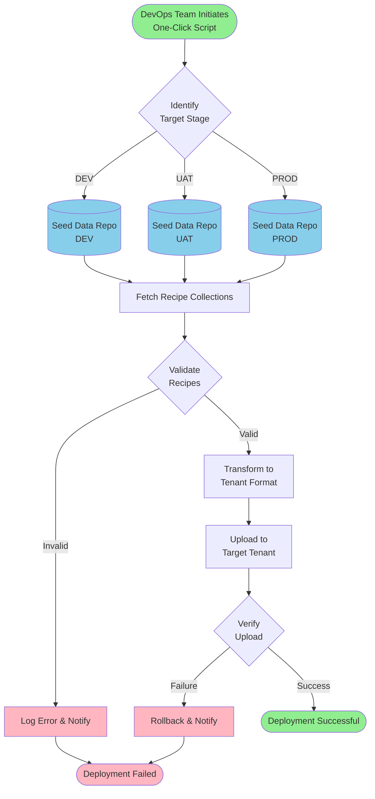

# Recipe Deployment Flow Diagram

## Overview
This document describes the deployment process for loading recipes into wm.io platform tenants across different stages (DEV, UAT, Production).

## Deployment Architecture

## Detailed Process Flow

### 1. Initiation Phase
- **Trigger**: DevOps team executes the one-click deployment script
- **Input**: Target stage (DEV/UAT/PROD)
- **Action**: Script initializes deployment process

### 2. Stage Identification
- **Process**: Script identifies the target deployment stage
- **Stages**:
  - **DEV**: Development environment
  - **UAT**: User Acceptance Testing environment
  - **PROD**: Production environment

### 3. Seed Data Repository Access
- **DEV Repo**: Contains recipe collections for development
- **UAT Repo**: Contains recipe collections for testing
- **PROD Repo**: Contains recipe collections for production
- **Structure**: Each repository maintains recipes as collections

### 4. Recipe Fetching
- **Action**: Retrieve recipe collections from the appropriate seed data repository
- **Format**: Recipes are stored as JSON collections
- **Scope**: All recipes configured for the target stage

### 5. Validation Phase
- **Schema Validation**: Verify recipe structure matches expected schema
- **Dependency Check**: Ensure all required dependencies are available
- **Version Compatibility**: Check recipe version compatibility with tenant
- **Outcome**: 
  - **Valid**: Proceed to transformation
  - **Invalid**: Log error and notify team

### 6. Transformation
- **Purpose**: Convert seed data format to tenant-specific format
- **Operations**:
  - Map recipe fields to tenant schema
  - Apply environment-specific configurations
  - Set appropriate permissions and metadata

### 7. Upload to Tenant
- **Target**: Respective tenant based on stage
- **Method**: Bulk upload via wm.io platform API
- **Monitoring**: Track upload progress and status

### 8. Verification
- **Checks**:
  - Verify all recipes are uploaded successfully
  - Validate recipe integrity in tenant
  - Confirm recipe accessibility
  - Test basic recipe functionality

### 9. Success Path
- **Logging**: Record successful deployment details
- **Notification**: Inform DevOps team of success
- **Documentation**: Update deployment history

### 10. Failure Path
- **Rollback**: Revert changes to previous stable state
- **Error Logging**: Capture detailed error information
- **Notification**: Alert DevOps team with error details
- **Investigation**: Provide logs for troubleshooting

## Key Components

### One-Click Deployment Script
- **Purpose**: Automate the entire deployment process
- **Features**:
  - Stage-aware deployment
  - Automatic validation
  - Error handling and rollback
  - Logging and monitoring
  - Notification system

### Seed Data Repository
- **Organization**: Separate repositories per stage
- **Content**: Recipe collections in JSON format
- **Version Control**: Git-based versioning
- **Access Control**: Stage-specific permissions

### Tenant Integration
- **API**: wm.io platform API for recipe management
- **Authentication**: Stage-specific credentials
- **Rate Limiting**: Managed bulk upload
- **Monitoring**: Real-time deployment tracking

## Deployment Best Practices

1. **Pre-Deployment**
   - Review recipe changes
   - Verify seed data repository is up-to-date
   - Ensure tenant is accessible
   - Check for any ongoing operations

2. **During Deployment**
   - Monitor deployment progress
   - Watch for validation errors
   - Track upload metrics
   - Be ready for rollback if needed

3. **Post-Deployment**
   - Verify all recipes are accessible
   - Test critical recipes
   - Review deployment logs
   - Update documentation

4. **Rollback Strategy**
   - Maintain previous recipe versions
   - Quick rollback capability
   - Minimal downtime
   - Clear rollback procedures

## Error Handling

### Common Errors
- **Schema Mismatch**: Recipe structure doesn't match expected format
- **Network Issues**: Connection problems with seed data repo or tenant
- **Permission Errors**: Insufficient access rights
- **Version Conflicts**: Recipe version incompatibility

### Resolution Steps
1. Check error logs for specific details
2. Verify seed data repository integrity
3. Confirm tenant connectivity
4. Validate credentials and permissions
5. Review recipe schema compatibility
6. Execute rollback if necessary
7. Fix issues and retry deployment

## Monitoring and Logging

### Metrics Tracked
- Deployment duration
- Number of recipes deployed
- Success/failure rate
- Validation errors
- Upload speed
- Rollback frequency

### Log Information
- Timestamp of each operation
- Stage and tenant details
- Recipe identifiers
- Error messages and stack traces
- User/script information
- Deployment status

## Security Considerations

1. **Access Control**: Stage-specific credentials
2. **Audit Trail**: Complete deployment history
3. **Data Integrity**: Validation and verification
4. **Secure Transfer**: Encrypted communication
5. **Rollback Security**: Secure previous versions

## Future Enhancements

- Automated testing post-deployment
- Progressive deployment (canary releases)
- A/B testing capabilities
- Enhanced monitoring dashboards
- Automated rollback triggers
- Multi-region deployment support