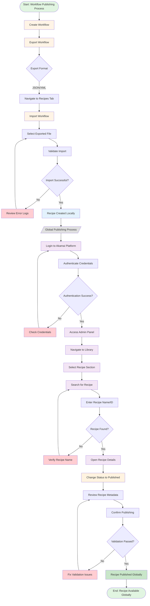
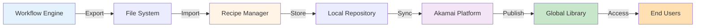
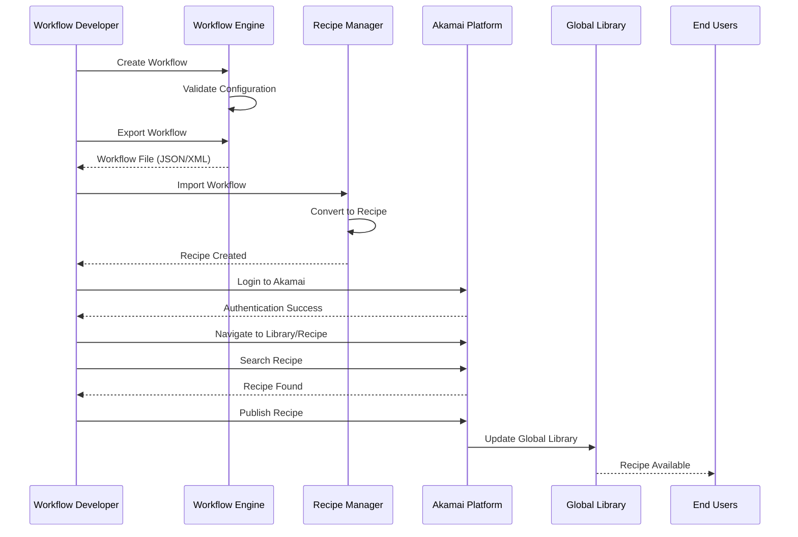

# Workflow to Recipe Publishing Flow

## Overview
This document outlines the complete process for publishing a workflow as a globally accessible recipe in the Akamai platform.

---

## Flow Diagram



---

## Detailed Process Steps

### Phase 1: Workflow Creation and Export
**Objective:** Create and export the workflow for recipe conversion

| Step | Action | Details | Responsible Role |
|------|--------|---------|------------------|
| 1 | **Create Workflow** | Design and configure the workflow with required components, triggers, and actions | Workflow Developer |
| 2 | **Export Workflow** | Export the workflow in supported format (JSON/XML) | Workflow Developer |
| 3 | **Validate Export** | Ensure exported file contains all workflow configurations | QA Engineer |

**Key Considerations:**
- Ensure workflow is fully tested before export
- Document any dependencies or prerequisites
- Verify all custom scripts and configurations are included

---

### Phase 2: Recipe Import and Local Setup
**Objective:** Convert exported workflow into a recipe

| Step | Action | Details | Responsible Role |
|------|--------|---------|------------------|
| 4 | **Navigate to Recipes Tab** | Access the recipes management interface | Recipe Administrator |
| 5 | **Import Workflow** | Upload the exported workflow file | Recipe Administrator |
| 6 | **Validate Import** | Verify recipe structure and metadata | Recipe Administrator |
| 7 | **Local Testing** | Test recipe functionality in local environment | QA Engineer |

**Key Considerations:**
- Check for import errors or warnings
- Validate recipe parameters and variables
- Ensure recipe description and documentation are complete

---

### Phase 3: Global Publishing via Akamai Admin
**Objective:** Publish recipe to global library for organization-wide access

#### 3.1 Authentication and Access

| Step | Action | Details | Responsible Role |
|------|--------|---------|------------------|
| 8 | **Login to Akamai** | Access Akamai platform with credentials | Platform Administrator |
| 9 | **Access Admin Panel** | Navigate to administrative interface | Platform Administrator |

**Security Requirements:**
- Multi-factor authentication (MFA) enabled
- Appropriate admin privileges
- Audit logging enabled

#### 3.2 Recipe Management

| Step | Action | Details | Responsible Role |
|------|--------|---------|------------------|
| 10 | **Navigate to Library** | Access the central library section | Platform Administrator |
| 11 | **Select Recipe Section** | Open recipe management area | Platform Administrator |
| 12 | **Search Recipe** | Locate the specific recipe by name or ID | Platform Administrator |

**Navigation Path:**
```
Akamai Dashboard → Admin → Library → Recipe
```

#### 3.3 Publishing

| Step | Action | Details | Responsible Role |
|------|--------|---------|------------------|
| 13 | **Open Recipe Details** | View complete recipe configuration | Platform Administrator |
| 14 | **Review Metadata** | Verify description, tags, version, and documentation | Platform Administrator |
| 15 | **Change Status** | Update recipe status from "Draft" to "Published" | Platform Administrator |
| 16 | **Confirm Publishing** | Execute final publishing action | Platform Administrator |

**Pre-Publishing Checklist:**
- [ ] Recipe tested in staging environment
- [ ] Documentation complete and accurate
- [ ] Version number updated
- [ ] Tags and categories assigned
- [ ] Dependencies documented
- [ ] Security review completed
- [ ] Approval from stakeholders obtained

---

## Architecture Components

### System Integration Points



### Data Flow



---

## Error Handling and Troubleshooting

### Common Issues and Resolutions

| Issue | Possible Cause | Resolution |
|-------|---------------|------------|
| Import Failure | Invalid file format | Verify export format matches import requirements |
| Authentication Error | Expired credentials | Refresh authentication tokens or re-login |
| Recipe Not Found | Incorrect name/ID | Verify recipe identifier and search criteria |
| Publishing Validation Failed | Missing metadata | Complete all required fields and documentation |
| Permission Denied | Insufficient privileges | Request admin access from platform administrator |

---

## Security and Compliance

### Access Control Matrix

| Role | Create Workflow | Export | Import | Publish Globally |
|------|----------------|--------|--------|------------------|
| Workflow Developer | ✅ | ✅ | ❌ | ❌ |
| Recipe Administrator | ✅ | ✅ | ✅ | ❌ |
| Platform Administrator | ✅ | ✅ | ✅ | ✅ |
| End User | ❌ | ❌ | ❌ | ❌ |

### Audit Trail

All publishing actions are logged with:
- User ID and timestamp
- Recipe name and version
- Status changes
- Approval chain
- IP address and session information

---

## Best Practices

### For Workflow Developers
1. **Documentation First**: Document workflow purpose, inputs, outputs, and dependencies
2. **Version Control**: Use semantic versioning (e.g., 1.0.0, 1.1.0)
3. **Testing**: Thoroughly test in development and staging environments
4. **Naming Convention**: Use clear, descriptive names for workflows and recipes

### For Recipe Administrators
1. **Validation**: Always validate imports before proceeding
2. **Metadata Quality**: Ensure complete and accurate metadata
3. **Change Management**: Follow change management procedures
4. **Communication**: Notify stakeholders of new recipe availability

### For Platform Administrators
1. **Security Review**: Conduct security review before global publishing
2. **Access Control**: Maintain principle of least privilege
3. **Monitoring**: Monitor recipe usage and performance
4. **Deprecation**: Plan for recipe lifecycle and deprecation

---

## Metrics and KPIs

### Publishing Process Metrics
- **Time to Publish**: Average time from workflow creation to global availability
- **Success Rate**: Percentage of successful imports and publications
- **Error Rate**: Number of errors encountered during process
- **Adoption Rate**: Number of users accessing published recipes

### Quality Metrics
- **Documentation Completeness**: Percentage of recipes with complete documentation
- **Test Coverage**: Percentage of recipes with comprehensive testing
- **User Satisfaction**: Feedback scores from recipe consumers

---

## Appendix

### Glossary

| Term | Definition |
|------|------------|
| **Workflow** | A sequence of automated tasks and processes |
| **Recipe** | A reusable, packaged workflow available in the library |
| **Export** | Process of converting workflow to portable format |
| **Import** | Process of loading workflow into recipe system |
| **Global Publishing** | Making recipe available to all users in organization |
| **Akamai Platform** | Enterprise platform for workflow and recipe management |

### Related Documentation
- Workflow Creation Guide
- Recipe Development Standards
- Akamai Platform Administration Manual
- Security and Compliance Guidelines

### Support Contacts
- **Workflow Support**: workflow-support@organization.com
- **Recipe Administration**: recipe-admin@organization.com
- **Platform Support**: platform-support@organization.com

---

**Document Version**: 1.0  
**Last Updated**: 2026-03-24  
**Author**: Technical Documentation Team  
**Review Cycle**: Quarterly